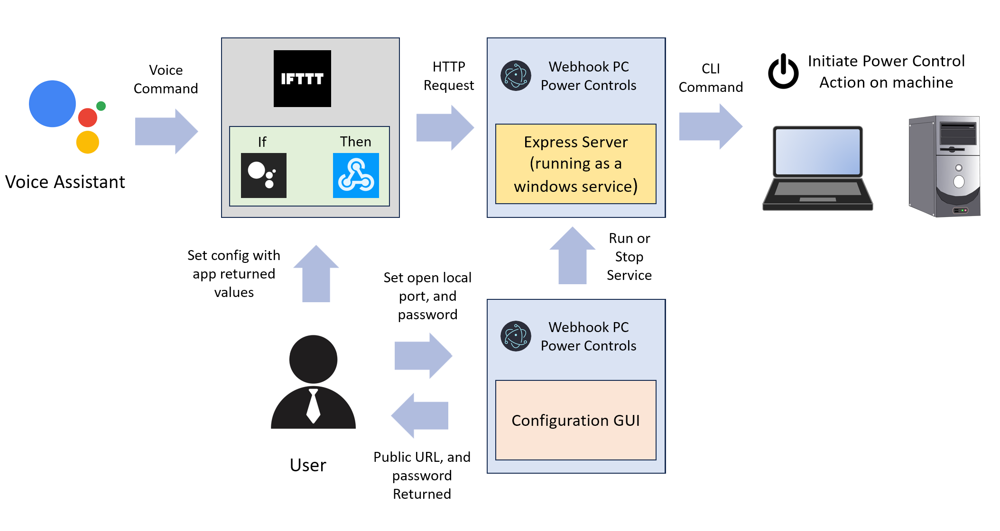
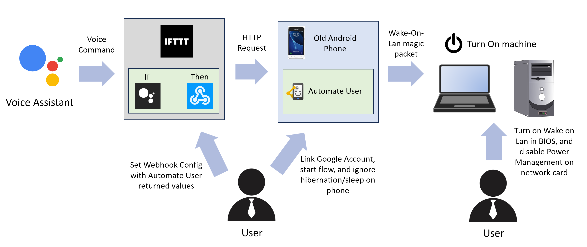

## Why create this app?

To solve one of the most pressing issues to ever exist, fueled by the joy of creating a new applica... just kidding. Today, the rise of IoT devices, and software are irrefutable. The ability to use a voice assistant to control countless routines, scenes, and actions is extremely powerful and useful. Yet, despite being able to tell devices like lights to turn off with a voice, its shockingly complex to do the same with a Windows machine.

There are solutions that allow remote access to a Windows machine, like [Chrome’s Remote Desktop](https://remotedesktop.google.com) or [Window’s version](https://support.microsoft.com/en-us/windows/how-to-use-remote-desktop-5fe128d5-8fb1-7a23-3b8a-41e636865e8c), but they are complex to setup, and require additional configuration to allow them to react to a voice assistant. Unless someone has a good understanding of networking and technical administration, this can be a ton of work. If a user wants full control of their machine, then this complex setup should be done, and is the recommended approach.

However, if a user just wants log out, shutdown or put a machine to sleep, the same way we turn off lights with a voice command, this complex setup would be a waste of time. Therefore, this app was created. 

## How it works

This Node.js application runs as a [windows service](https://docs.microsoft.com/en-us/dotnet/framework/windows-services/introduction-to-windows-service-applications) with the help of [`node-windows`](https://www.npmjs.com/package/node-windows). This is the key difference from other solutions like [Join](https://chrome.google.com/webstore/detail/join/flejfacjooompmliegamfbpjjdlhokhj?hl=en), as they can only run while a user active, and logged in. However, a window service can always run, no matter who is signed in, or if the computer is locked. Therefore, if a user has set their computer to lock after a period inactivity, they don't have to sign back in to initate power controls.

This windows service launches an [`express`](https://expressjs.com) web server that uses a public callback url supplied by [`localtunnel`](https://github.com/localtunnel/localtunnel), to respond to an HTTP `POST` request from anywhere on the web. This allows us to use [webhooks](https://en.wikipedia.org/wiki/Webhook), to initiate a power control action (i.e logout, shutdown, sleep, etc) by supplying a [valid json payload](#json-payload) in the request.

## Example Automation using IFTTT and Google Assistant

#### Helpful Resources for this type of automation:
- Create an [IFTTT Applet](https://help.ifttt.com/hc/en-us/articles/115010361348-What-is-an-Applet-)
- Link [IFTTT and Google Assistant](https://support.google.com/googlenest/answer/7194656?hl=en&co=GENIE.Platform%3DDesktop&oco=1)

## Installation
- [Install With GUI (Graphic User Interface)](./install/withGui/README.md)
- [Install Without GUI](./install/withoutGui/README.md)

## Configuration Variables

- `PORT`=`number` (**required**)

  This should be an accepted port value between 1024 to 49151, to prevent port duplication

- `PASSWORD`=`string` (**required**)

  This must configured, since this service will supply a public-facing url, that anyone in the internet may call.

  - To prevent unwanted access, ensure this [password is strong](https://support.microsoft.com/en-us/windows/create-and-use-strong-passwords-c5cebb49-8c53-4f5e-2bc4-fe357ca048eb).
  - Consider using a [password generator](https://www.lastpass.com/features/password-generator-a#generatorTool)

- `CUSTOM_SUB_DOMAIN`=`string` (**optional**)

  This allows the user to define an optional subdomain name.
  - Your urls will MOST likely take the following form: `https://pc-power-settings-*CUSTOM_SUB_DOMAIN*-*uuid*.loca.lt`
  - This subdomain name will have a `unique id` appended to the end off it, to prevent collisions.
  - **Note**: Behind the scenes, this application uses [`localtunnel`](https://github.com/localtunnel/localtunnel) to generate public-facing urls.

## Accepted HTTP Request
### Example Request
```
POST / HTTP/1.1
Host: pc-power-settings-1234567.loca.lt
Content-Length: 56

{
   "password": "example",
   "action": "shutdown"
}
```
### Public Callback URL 
  - ```https://pc-power-settings-*CUSTOM_SUB_DOMAIN*-*uuid*.loca.lt```
      -  `CUSTOM_SUB_DOMAIN`: `string` (**optional**)
        - Will only exist if you specify one
      - `uuid`: `string`
        - This automatically set to ensure you don't collide with another user's configuration, as it will ensure uniquness, therby allowing you to use it as a stable url
### JSON Payload
- `password`: `string` (**required**)

  - This should be the same string you have in your [`config.json`](#configuration-variables) file when you first installed the service.

- `action`: `sleep | shutdown | restart | hibernate | logout` (**required**)
  - The action the windows service should initate on the machine. Only one type is accepted.

## Turning a Computer on
This isn't possible to configure using this application, because our app by design, can only run when the computer is on. However there are already existing solutions. Read on to set this up for yourself.

### Requirements:
Options: 
- If you can't run an ethernet cable
  - IOT Button Pusher (i.e SwitchBot)
    - Simulates a Button Push, but requires the button push switch, and a Hub to connect the switch to your wifi (~$70 - $100 dollars)
    - Note, you can also use it to power a PC off, but it will actually perform a force shutdown, which can cause data corruption.
  - 15A rated Smart Plug that works as a Relay Switch
    - Requires you to set your computer to automatically power on after power loss in your BIOS. This setting is usually called ***Restore on AC/Power Loss***
    - With the method, similar to above, you can turn the PC off, but it may result in data corruption. This method can also cause stress on your PC components leading to hardware damage in the long-run, as the PC shuts off IMMEADITELY.
    - Note: Won't work for laptops as they have batteries. Therefore the battery would need to be removed, which defeats the purpose of a laptop.

- If you can run an ethernet cable (Preferred, since it requires no extra hardware)
  1. The use of [Wake-On-Lan](https://en.wikipedia.org/wiki/Wake-on-LAN)
      - Your computer must be connected to your network, via ethernet, and your PC's motherboard/and or network card MUST support it. Most modern computers in the last decade do. 
  2. [Disable Power Management on your network adapter card](https://learn.microsoft.com/en-us/troubleshoot/windows-client/networking/power-management-on-network-adapter)
      - Needed so that even in sleep, standby or hibernation mode, the pc can be woken up.
      - You can also disable this via [Device Manager](https://www.intel.com/content/www/us/en/support/articles/000005879/wireless/legacy-intel-wireless-products.html) and ***un-checking*** *Allow the computer to turn off this device*
  3. Another device (like an old phone, Rasberry Pi, or another computer), that is always on and connected to the local network.
  4. Software on the other device, that will listen to a Cloud (using a linked Google Account) or SMS message, and trigger a Wake-On-Lan call. Below are some popular options:
      - [Automate](https://play.google.com/store/apps/details?id=com.llamalab.automate&hl=en_US&gl=US) (Andriod Only)
      - [Tasker](https://play.google.com/store/apps/details?id=net.dinglisch.android.taskerm&hl=en_US&gl=US) (Andriod Only)
      - [Communication Triggers](https://support.apple.com/guide/shortcuts/communication-triggers-apdd711f9dff/ios) (iPhone Only)

### Example Google Assistant and Automate on Andriod Flow, that listens to a Cloud Message:

