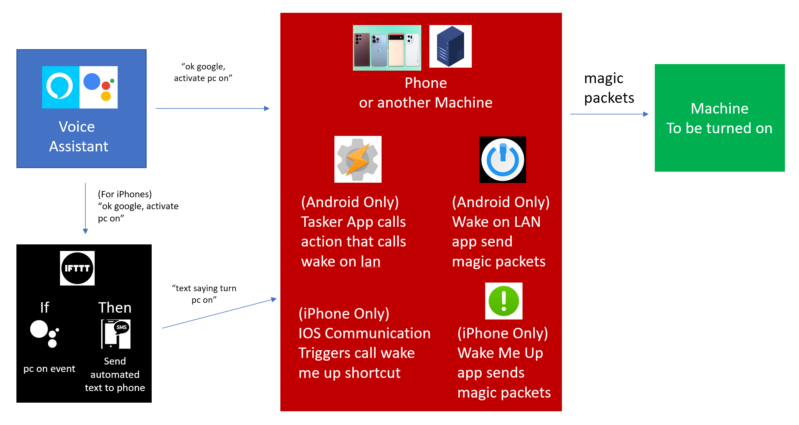

## Why create this app?

To solve one of the most pressing issues to ever exist, fueled by the joy of creating a new applica... just kidding. Today, the rise of IoT devices, and software are irrefutable. The ability to use a voice assistant to control countless routines, scenes, and actions is extremely powerful and useful. Yet, despite being able to tell devices like lights to turn off with a voice, its shockingly complex to do the same with a Windows machine.

There are solutions that allow remote access to a Windows machine, like [Chrome’s Remote Desktop](https://remotedesktop.google.com) or [Window’s version](https://support.microsoft.com/en-us/windows/how-to-use-remote-desktop-5fe128d5-8fb1-7a23-3b8a-41e636865e8c), but they are complex to setup, and even then, additional configuration is required to allow them to react to a voice assistant. Unless someone has a good understanding of networking and technical administration, this can be a ton of work. If a user wants to control their machine from opening files to installing applications, then this complex setup should be done, and is the recommended approach.

However, if a user just wants log out, shut down or put a machine to sleep, the same way we turn off lights with a voice command, this complex setup would be a waste of time. Therefore, this app was created.

## How it works

This Node.js application runs as a [windows service](https://docs.microsoft.com/en-us/dotnet/framework/windows-services/introduction-to-windows-service-applications) with the help of [`node-windows`](https://www.npmjs.com/package/node-windows). This service launches an [`express`](https://expressjs.com) web server that uses a public callback url supplied by [`localtunnel`](https://github.com/localtunnel/localtunnel), to respond to `POST` requests from anywhere on the web. This allows us to use [webhooks](https://en.wikipedia.org/wiki/Webhook), to initiate a logout, shutdown, or sleep action, by supplying a [valid json payload](#json-payload) in the post request.

## Example Automation using IFTTT

#### Helpful Resources for this type of automation:

- Create an [IFTTT Applet](https://help.ifttt.com/hc/en-us/articles/115010361348-What-is-an-Applet-)
- Link [IFTTT and Google Assistant](https://support.google.com/googlenest/answer/7194656?hl=en&co=GENIE.Platform%3DDesktop&oco=1)

## Installation

- [Install With GUI (Graphic User Interface)](./installWithGui/README.md)
- [Install Without GUI](./installWithoutGui/README.md)

## Configuration Variables

- `PORT`=`number` (**required**)

  This should be an accepted port value between 1024 to 49151, to prevent port duplication

- `PASSWORD`=`string` (**required**)

  This must configured, since this service will supply a public-facing url, that anyone in the internet may call.

  - To prevent unwanted access, ensure this [password is strong](https://support.microsoft.com/en-us/windows/create-and-use-strong-passwords-c5cebb49-8c53-4f5e-2bc4-fe357ca048eb).
  - Consider using a [password generator](https://www.lastpass.com/features/password-generator-a#generatorTool)

- `CUSTOM_SUB_DOMAIN`=`string` (**optional**)

  This allows the user to define an optional subdomain name.

  - You are not guaranteed to be given your custom name, as it depends on availability

  - To improve your odds, consider using a [uuid generator](https://www.uuidgenerator.net) for the name

  - Your urls will MOST likely take the following form: `https://pc-power-settings-*CUSTOM_SUB_DOMAIN*.loca.lt`

  - **Note**: Behind the scenes, this application uses [`localtunnel`](https://github.com/localtunnel/localtunnel) to generate public-facing urls.

## JSON Payload

- `password`: `string` (**required**)

  - This should be the same string you have in your [`config.env`](#configuration-variables) file when you first installed the service.

- `action`: `sleep | shutdown | restart | hibernate | logout` (**required**)
  - The action the windows service should initate on the machine. Only one type is accepted.

## Limitations using the GUI

#### Issue:

Right now, after this electron app is packaged for distribution, the .exe file created by `electron-forge`, is not compatible with [`node-windows`](https://www.npmjs.com/package/node-windows), and when the [serviceInstall]("./service_app/serviceInstall.js) runs, `node-windows` fails to start it's own generated windows service `.exe` file. This occurs because using `electron forge's` generated `.exe`, to run the windows service `.exe` results in improper path mappings, causing the windows service script to fail, and stop.

#### Solution:

To circumvent this issue, we use [`node-windows`](https://www.npmjs.com/package/node-windows) execPath parameter to use our own custom `node.exe`, to run the windows service's `.exe`. This results in proper path mappings, and a successful initiation of a our windows service

#### Caveat

Since we use our own custom `node.exe` file, the package size for this app is greatly increased, if you need to use the GUI (The `node.exe` file is ~60mb) As a result, if you really want a slimmer app, you should run the [app without the GUI](./installWithoutGui/README.md). Note, that if you want to do this, you will need a good understanding of your terminal, and [node.js](https://nodejs.org/en/)

## Turning on Computer

This app is **NOT** designed to turn **ON** a PC as this requires

1. The use of [Wake-On-Lan](https://en.wikipedia.org/wiki/Wake-on-LAN) magic packets
   - For these to be sent, the PC must be connected to an ethernet cable
2. Another device (like a phone or another computer), to initate a command to send a magic packet.

Additionally, other existing apps used in combination do this job extremely well.
    -  [Wake-On-Lan](https://play.google.com/store/apps/details?id=co.uk.mrwebb.wakeonlan&hl=en_US&gl=US) for Andriod or [Wake Me Up](https://apps.apple.com/us/app/wake-me-up-wake-on-lan/id1465416032) for iPhones, to send magic packets
    -  [Tasker](https://play.google.com/store/apps/details?id=net.dinglisch.android.taskerm&hl=en_US&gl=US) for Andriod, or [Communication Triggers](https://support.apple.com/guide/shortcuts/communication-triggers-apdd711f9dff/ios) for iPhones, that trigger a workflow that runs wake on lan, based off SMS messages.

#### Example Flow for Turning On a PC:

For more information to turn on a PC with a voice assistant or a webhook, you can take a look at the following resources:

- [Voice Assistant](https://vishalvinjapuri.wordpress.com/2017/04/10/turning-on-your-computer-with-voice-alexa-and-ifttt/)
- [WebHook](https://medium.com/@pupdad/how-to-use-your-assistant-to-turn-on-your-pc-mac-the-right-way-2722add315df)
- [Communication Triggers](https://support.apple.com/guide/shortcuts/communication-triggers-apdd711f9dff/ios)