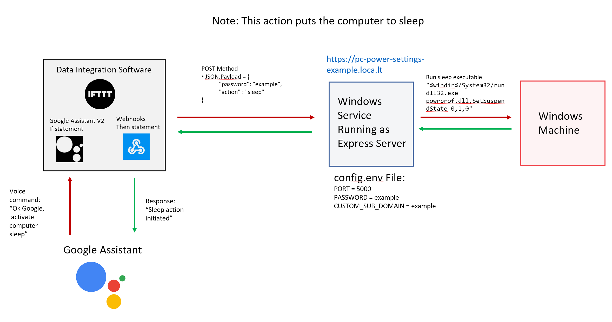

## Why create this app?
To solve one of the most pressing issues to ever exist, fueled by the joy of creating a new applica... just kidding. Today, the rise of IoT devices, and software are irrefutable. The ability to use a voice assistant to control countless routines, scenes, and actions is extremely powerful and useful. Yet, despite being able to tell devices like lights to turn off with a voice, its shockingly complex to do the same with a Windows machine.

There are solutions that allow remote access to a Windows machine, like [Chrome’s Remote Desktop](https://remotedesktop.google.com) or [Window’s version](https://support.microsoft.com/en-us/windows/how-to-use-remote-desktop-5fe128d5-8fb1-7a23-3b8a-41e636865e8c), but they are complex to setup, and even then, additional configuration is required to allow them to react to a voice assistant. Unless someone has a good understanding of networking and technical administration, this can be a ton of work. If a user wants to control their machine from opening files to  installing applications, then this complex setup should be done, and is the recommended approach. 

However, if a user just wants log out, shut down or put a machine to sleep, the same way we turn off lights with a voice command, this complex setup would be a waste of time. Therefore, this app was created. 

## How it works
This Node.js application runs as a [windows service](https://docs.microsoft.com/en-us/dotnet/framework/windows-services/introduction-to-windows-service-applications) with the help of [`node-windows`](https://www.npmjs.com/package/node-windows). This service launches an [`express`](https://expressjs.com) web server that uses a public callback url supplied by [`localtunnel`](https://github.com/localtunnel/localtunnel), to respond to `POST` requests from anywhere on the web. This allows us to use [webhooks](https://en.wikipedia.org/wiki/Webhook), to initiate a logout, shutdown, or sleep action, by supplying a [valid json payload](#json-payload) in the post request. 

## Example Automation using IFTTT
#### Helpful Resources for this type of automation: 
- Create an [IFTTT Applet](https://help.ifttt.com/hc/en-us/articles/115010361348-What-is-an-Applet-)
- Link [IFTTT and Google Assistant](https://support.google.com/googlenest/answer/7194656?hl=en&co=GENIE.Platform%3DDesktop&oco=1)

## Installation
- [Install With GUI(Graphic User Interface)]()
- [Install Without GUI](./installWithGui/README.md)
## Environment Variables
  - `PORT`: `number` (**required**)
  
     This should be an accepted port value between 1024 to 49151, to prevent port duplication
      
  - `PASSWORD`: `string` (**required**)
  
     This must configured, since this service will supply a public-facing url, that anyone in the internet may call. 
     - To prevent unwanted access, ensure this [password is strong](https://support.microsoft.com/en-us/windows/create-and-use-strong-passwords-c5cebb49-8c53-4f5e-2bc4-fe357ca048eb).
     - Consider using a [password generator](https://www.lastpass.com/features/password-generator-a#generatorTool)
  - `CUSTOM_SUB_DOMAIN`: `string` (**optional**)
      
      This allows the user to define an optional subdomain name. 
      - You are not guaranteed to be given your custom name, as it depends on availability 

      - To improve your odds, consider using a [uuid generator](https://www.uuidgenerator.net) for the name

      - Your urls will MOST likely take the following form: `https://pc-power-settings-*CUSTOM_SUB_DOMAIN*.loca.lt`

      - **Note**: Behind the scenes, this application uses [`localtunnel`](https://github.com/localtunnel/localtunnel) to generate public-facing urls. 

## JSON Payload
- `password`: `string` (**required**)
    
    - This should be the same string you have in your [`config.env`](#environment-variables) file when you first installed the service.

- `action`: `sleep | logout | shutdown` (**required**)
    
    - The action the windows service should initate on the machine
